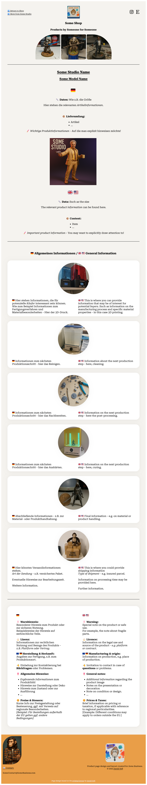
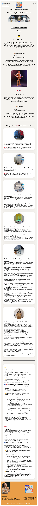

# Product Page Template


>This project provides a fully responsive template for a product info page, optimised for desktop, tablet, and mobile devices.
<br><br>
>>I originally designed this layout for my old eBay shop in order to provide interested customers with more extensive information about my products via the modifiable "Seller's item description" form.
<br><br>
This is why the page is so long on one hand and why elements such as an image gallery, "Add to basket" button etc. are missing on the other hand.
In addition, the form does not allow JavaScript, which is why everything had to be realised with HTML and CSS.
<br><br>
>>><b>Note:</b> If this page design is to be used for eBay listings, all images used must be loaded from a stable online storage, as it is not possible to set up an ‘Assets’ folder for eBay listings.

><b>Live Demo on GitHub Pages: </b> <a href="https://david-voss.github.io/Product-Page-Template/" target="_blank" rel="noopener noreferrer" title="david-voss.github.io/Product-Page-Template/">Product Page Template School</a>

## Table of contents
1. &#128450;&#65039; Prject Structure
2. &#127760; Features
3. &#9997;&#65039; Customisation Guide
4. &#169;&#65039; Author & Credits
5. &#128196; Licence
6. &#128444;&#65039; Template Preview
7. &#128444;&#65039; Example Preview


## &#128450;&#65039; Prject Structure

```
product-page/  
├── index.html              #-> Main product page 
├── index_private.html      #-> Internal / private version
├── formatted_for_ebay/     #-> Formatted for use in eBay listings
│   ├── index_ebay.html     #-> Contains the entire CSS code in a <style> tag  
├── css/  
│   ├── style.css           #-> Desktop styling 
│   ├── style-tablet.css    #-> Tablet-specific styles 
│   └── style-mobile.css    #-> Mobile-specific styles
├── assets/
│   ├── icons/              #-> Social media icons (Etsy, Instagram)  
│   ├── private/            #-> Internal images (not for public use) 
│   └── template_images/    #-> Placeholder images for fallback
├── readme-screenshots/     #-> Screenshots for documentation 
├── .gitignore 
├── LICENSE.md 
└── README.md
```


## &#127760; Features

- **Responsive design**: Custom styling for desktop, tablet and mobile
- Layout: **Grid** and **Flexbox**
- **Bilingual**: German (de-DE) and English (en-GB) content displayed side by side
- **Image fallbacks**: Automatically loads placeholders if custom images are missing
- **Modular card layout** for production steps and product info
- **Sections** for legal details, warnings and contact information   
- **Social media integration** with clickable icons and links 


## &#9997;&#65039; Customisation Guide

To personalise the template, simply update the placeholders:

- `Some Shop`, `Some Studio Name`, `Some Product`, etc. → Replace with your brand and product names
- `assets/#.jpg` → Add your own images or update paths
- Edit the `<title>` tag in the `<head>` section
- Insert your real contact details and social media URLs


## &#169;&#65039; Author & Credits

Product page design and layout created by  
**David Voß**  
[GitHub: David-Voss](https://github.com/David-Voss)


>You are welcome to use, adapt, or redistribute this codebase for both personal and commercial purposes. <br>
However, proper attribution is required in all public or published uses of this template.

Please include a visible reference to the original author – for example, in the page footer – as seen in this template:

```
<div class="credit">
    <p>
        <small>
            <em>
                Page design based on the <a href="https://github.com/David-Voss/Product-Page-Template" title="github.com/David-Voss/Product-Page" target="_blank" rel="noopener noreferrer">original layout</a> by <a href="https://github.com/David-Voss" title="github.com/David-Voss" target="_blank" rel="noopener noreferrer">David Voß</a>.
            </em>
        </small>
    </p>
</div>
```
>│ #-> See the preview images or HTML files for examples.<br>
└──><em>Page design based on the original <u>layout</u> by <u>David Voß</u>.</em>


## &#128196; Licence

This project is distributed under the following terms:

&#9989; Code Usage: You are free to use, modify, and distribute the code for any purpose (_personal or commercial_) – _no attribution required in private use_, but **attribution is required in public or published works**.

&#128683; Image Assets: All images included in this repository (e.g. assets/template_images, assets/private, or readme_screenshots) are for demonstration purposes only. You may not reuse, redistribute or republish them in your own projects.

Please refer to the [LICENCE.md](./LICENCE.md) file for formal details.

---


## &#128444;&#65039; Template Preview

### **_Desktop view:_**
 <br><br>
---

### **_Tablet view:_**
 <br><br>
---

### **_Mobile view:_**
 <br><br>

---

## &#128444;&#65039; Example Preview

### **_Desktop view:_**
<br> <br><br>
---

### **_Tablet view:_**
 <br><br>
---

### **_Mobile view:_**
 <br><br>
---